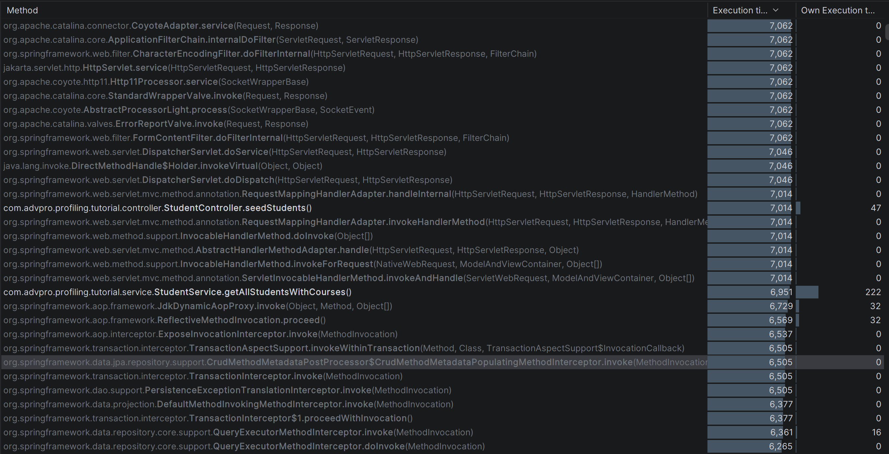
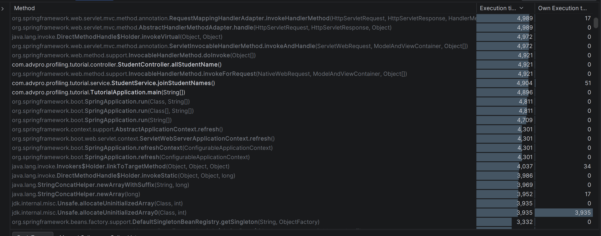
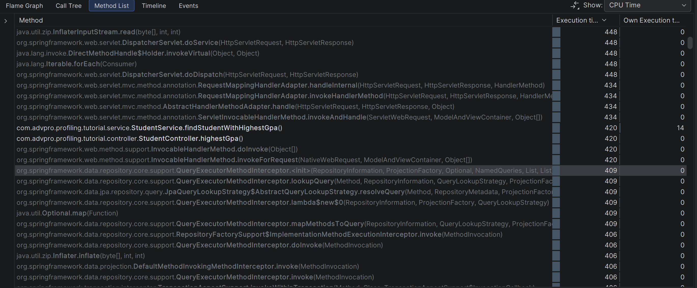
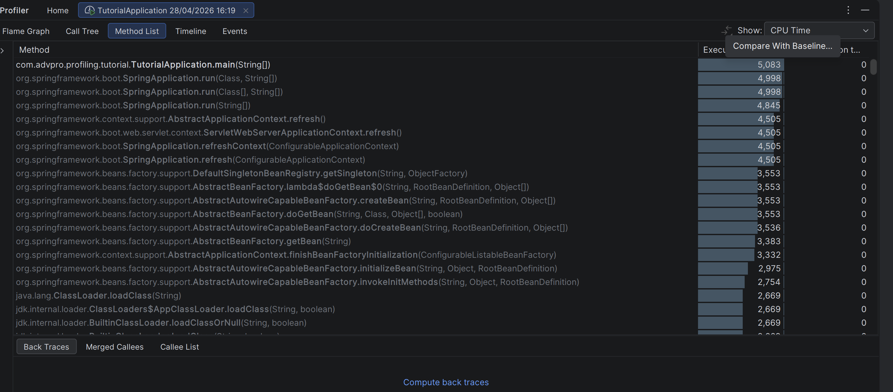
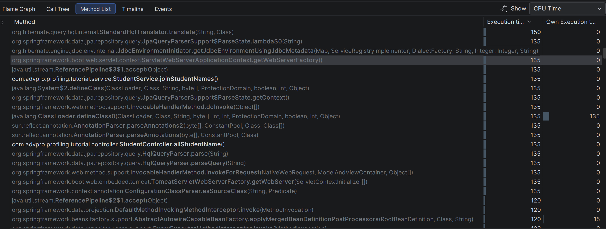
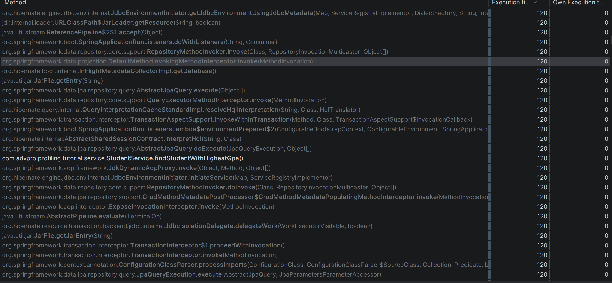
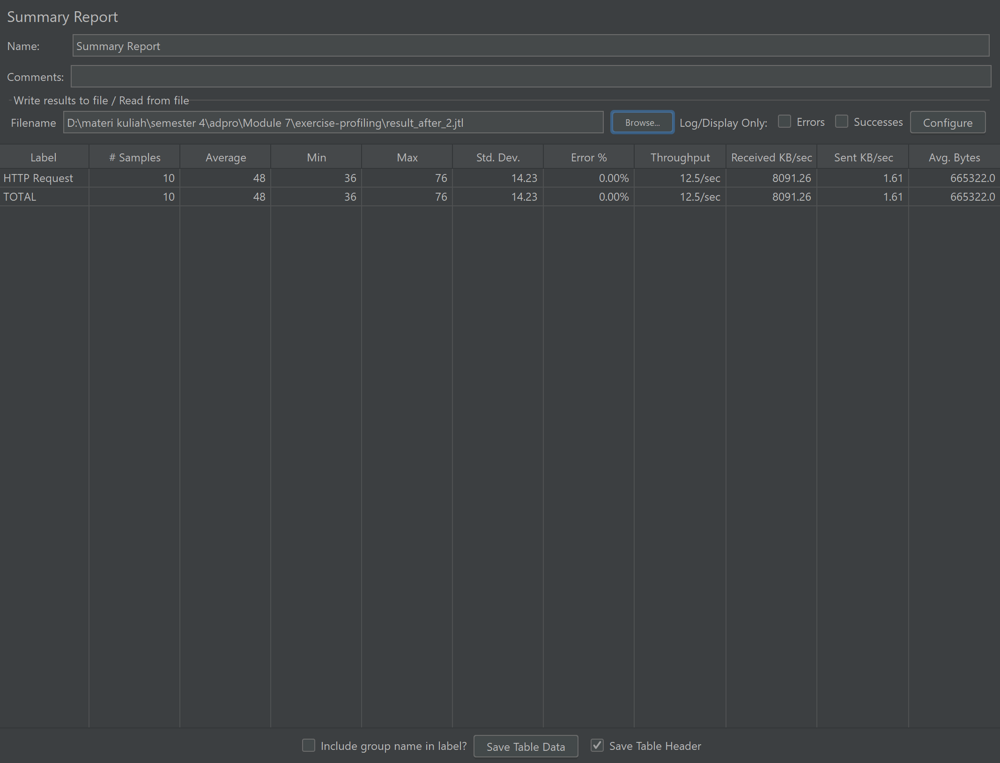
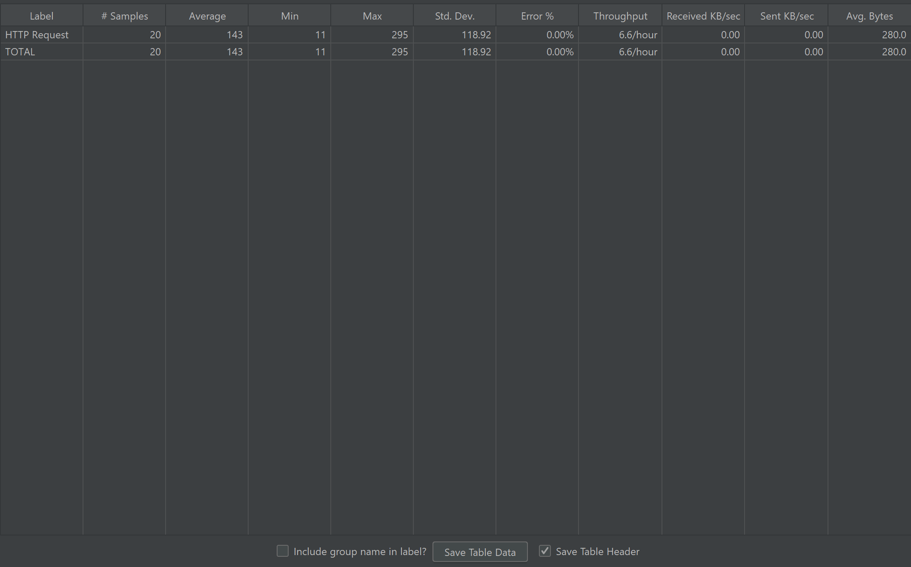

## Performance Testing (Before Optimization)

### /all-student


### /all-student-name


### /highest-gpa


---

## Profiling (Before Optimization)

### /all-student


Bottleneck was found in:

```java
StudentService.getAllStudentsWithCourses()
```

### /all-student-name


Bottleneck was found in:

```java
StudentService.joinStudentNames()
```

### /highest-gpa


Bottleneck was found in:

```java
StudentService.findStudentWithHighestGpa()
```

---

## Optimization

### /all-student

The optimization was done by reducing repeated database queries and fetching the related student-course data directly using a join fetch query.

```java
@Query("SELECT sc FROM StudentCourse sc " +
       "JOIN FETCH sc.student " +
       "JOIN FETCH sc.course")
List<StudentCourse> findAllWithStudentAndCourse();
```

### /all-student-name

The optimization was done by fetching only the required student name field instead of fetching full `Student` entities.

```java
@Query("SELECT s.name FROM Student s")
List<String> findAllStudentNameOnly();
```

The service method still returns `String`, so the endpoint response format remains the same.

### /highest-gpa

The optimization was done by delegating the sorting process to the database.

```java
Optional<Student> findTopByOrderByGpaDesc();
```

---

## Profiling (After Optimization)

### /all-student


### /all-student-name


### /highest-gpa


---

## Performance Testing (After Optimization)

### /all-student


### /all-student-name


### /highest-gpa


---

## JMeter Result Comparison

### Detailed JMeter Results

| Endpoint | Phase | # Samples | Average | Min | Max | Std. Dev. | Error % | Throughput | Received KB/sec | Sent KB/sec | Avg. Bytes |
|---|---|---:|---:|---:|---:|---:|---:|---|---:|---:|---:|
| `/all-student` | Before | 10 | 51820 ms | 51329 ms | 52309 ms | 366.75 | 0.00% | 11.4/min | 184.27 | 0.02 | 994182.0 |
| `/all-student` | After | 10 | 237 ms | 92 ms | 477 ms | 149.67 | 0.00% | 11.3/sec | 10970.41 | 1.40 | 994182.0 |
| `/all-student-name` | Before | 10 | 4941 ms | 4748 ms | 5284 ms | 152.09 | 0.00% | 1.7/sec | 1111.41 | 0.22 | 665322.0 |
| `/all-student-name` | After | 10 | 48 ms | 36 ms | 76 ms | 14.23 | 0.00% | 12.5/sec | 8091.26 | 1.61 | 665322.0 |
| `/highest-gpa` | Before | 10 | 260 ms | 233 ms | 295 ms | 21.24 | 0.00% | 9.2/sec | 2.52 | 1.15 | 280.0 |
| `/highest-gpa` | After | 20 | 143 ms | 11 ms | 295 ms | 118.92 | 0.00% | 6.6/hour | 0.00 | 0.00 | 280.0 |

### Average Response Time Comparison

| Endpoint | Average Before | Average After | Improvement |
|---|---:|---:|---:|
| `/all-student` | 51820 ms | 237 ms | 99.54% |
| `/all-student-name` | 4941 ms | 48 ms | 99.03% |
| `/highest-gpa` | 260 ms | 143 ms | 45.00% |

The improvement was calculated using the following formula:

```text
((Average Before - Average After) / Average Before) * 100%
```

Detailed calculation:

```text
/all-student:
((51820 - 237) / 51820) * 100% = 99.54%

/all-student-name:
((4941 - 48) / 4941) * 100% = 99.03%

/highest-gpa:
((260 - 143) / 260) * 100% = 45.00%
```

Based on the JMeter Summary Report, all endpoints had `0.00%` error rate before and after optimization. The biggest improvement happened on `/all-student`, where the average response time decreased from `51820 ms` to `237 ms`. The `/all-student-name` endpoint also improved significantly from `4941 ms` to `48 ms`. The `/highest-gpa` endpoint improved from `260 ms` to `143 ms`, although the after test used `20` samples while the before test used `10` samples.

---

## Reflection

### 1. What is the difference between the approach of performance testing with JMeter and profiling with IntelliJ Profiler?

Performance testing with JMeter focuses on measuring the application from the user's point of view. It shows how fast an endpoint responds, how many requests can be handled, and whether there are failed requests. In this exercise, JMeter helped me compare the response time of `/all-student`, `/all-student-name`, and `/highest-gpa` before and after optimization. Meanwhile, IntelliJ Profiler focuses on the internal execution of the application by showing which methods consume significant execution time.

### 2. How does the profiling process help you in identifying and understanding the weak points?

The profiling process helped me identify which service methods were related to the slow endpoints. From the Method List, I could see methods such as `getAllStudentsWithCourses()`, `joinStudentNames()`, and `findStudentWithHighestGpa()`. This made the optimization process more focused because I did not need to guess which part of the code caused the performance issue. The profiler results also helped me connect the slow JMeter response time with the actual implementation in the service layer.

### 3. Do you think IntelliJ Profiler is effective in assisting you to analyze and identify bottlenecks?

Yes, IntelliJ Profiler is effective because it provides method-level information during application execution. The Method List view helped me find the methods that were executed when each endpoint was accessed. It was also useful because the result showed both application methods and framework methods, so I could focus on the methods from the project package. This helped me decide which methods should be optimized first.

### 4. What are the main challenges you face when conducting performance testing and profiling?

The main challenge was making sure that the profiling result represented the correct endpoint and not only the application startup process. Since Spring Boot and Hibernate also appear in the profiler result, I needed to carefully look for methods from the project package. Another challenge was keeping the API behavior the same after optimization, especially for `/all-student-name`, because the method returns a `String` instead of a `List<String>`. I also needed to make sure that the JMeter result files were loaded correctly into the Summary Report.

### 5. What are the main benefits you gain from using IntelliJ Profiler?

The main benefit of using IntelliJ Profiler is that it helps identify performance issues based on actual runtime behavior. It shows which methods are involved when an endpoint is accessed, so the optimization can be based on evidence. In this exercise, it helped me understand that the performance problems were related to inefficient database access and unnecessary data processing. It also helped confirm that the optimized methods were still executed correctly after refactoring.

### 6. How do you handle situations where results from profiling are not consistent with JMeter findings?

When profiling results are not consistent with JMeter findings, I compare them based on their different purposes. JMeter measures the full request-response time from outside the application, while IntelliJ Profiler measures internal method execution. If the results do not match, I rerun the test after making sure the application is already warmed up and the correct endpoint is accessed. I also check whether the difference might be caused by database access, framework overhead, application startup, or the way the JMeter test was executed.

### 7. What strategies do you implement in optimizing application code after analyzing results?

After analyzing the results, I optimized the code by reducing unnecessary database operations and moving suitable work to the database. For `/all-student`, I used a join fetch query to reduce repeated queries when retrieving student-course data. For `/all-student-name`, I changed the query so that it only retrieves student names instead of full student entities. For `/highest-gpa`, I delegated the sorting process to the database by using a repository method that directly returns the student with the highest GPA.